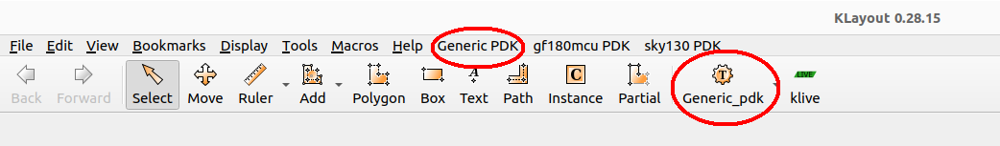

Generic Process Design Kit for Gdsfactory
=========================================

[](/LICENSE)  [](https://github.com/mabrains/) [](https://gdsfactory.github.io/gdsfactory/components.html)

[<p align="center">](http://mabrains.com/)


# Table of contents
- [Generic Process Design Kit for Gdsfactory](#generic-process-design-kit-for-gdsfactory)
- [Table of contents](#table-of-contents)
  - [Introduction](#introduction)
  - [Current-Status](#current-status)
  - [Generic-PDK](#generic-pdk)
  - [Prerequisites](#prerequisites)
  - [Installation](#installation)
  - [Usage](#usage)
  - [About Mabrains](#about-mabrains)
  - [Contact-Us](#contact-us)
  - [License](#license)


## Introduction

The generic open source PDK is a collaboration between Mabrains and Gdsfactory to provide a fully open source process design kit (PDK) and related resources to enable the creation of photonic designs manufacturable.


## Current-Status

> :warning: We are currently treating the current content as an **experimental preview!**

The PDK will be tagged with a production version when ready to do production design.

## Generic-PDK

This repository contains the full pdk inspired from Gdsfactory generic technology.

This includes:

 * Schematic symbols
 * DRC
 * LVS
 * Pcells

 Currently it supports;

  * For Schematic:
     - Xschem
  * For DRC/LVS/Pcells:
     - Klayout

## Prerequisites

At a minimum:

- python 3.10+
- gdsfactory 7.11.2+
- klayout 0.28.14+
- xschem V3.1.0+
- python3-venv

## Installation

First, you would need to clone the project in a location where you want to keep your pdk and associated environment:
```bash
git clone https://github.com/mabrains/gdsfactory-generic-pdk
```

After this, you will need to create a python virtual environment:
```bash
python3 -m venv ./generic_pdk_env && source ./generic_pdk_env/bin/activate
```
And then
```bash
cd gdsfactory-generic-pdk
```

To install required python packages, you need to run the following command:
```bash
pip install -r requirements.txt
```

To install the Generic-PDK for klayout tool, you could run the following commands:

```bash
    install_tech.py (--help| -h)
    install_tech.py (--tech_name=<tech_name>) (--tech_path=<tech_path>)
```

Example:

```bash
python3 install_tech.py --tech_name=Generic_PDK --tech_path=$PWD/klayout
```

This will add the Generic-PDK technology in the Klayout tool as shown:

<p align="center">
  
</p>
<p align="center">
  Fig. 1. Klayout Generic-PDK Loaded
</p>

## Usage

Please refer to [xschem-symbols](./xschem/README.md) for more information about symbols usage.

Please refer to [klayout](./klayout/README.md) for more information about DRC/LVS/PCells usage.

## About Mabrains

Mabrains was founded to achieve the main purpose to change the world of Chip Design using AI. Empowering the world with a new methodologies and techniques that would disrupt the status quo in the EDA industry.

We have contributed in developing many PDKs for Open Source Tools. For more information, please refer to [Mabrains-Github](https://github.com/mabrains).

## Contact-Us

Requests for more information about Generic PDK and other open source technologies can be [submitted via this web form](https://mabrains.com/#contactus).


## License

The Generic PDK is released under the [GNU Lesser General Public License - Version 3](/LICENSE)

The copyright details (which should also be found at the top of every file) are;

```
# SPDX-FileCopyrightText: 2024 Mabrains Company
# Licensed under the GNU Lesser General Public License, Version 3.0 (the "License");
# you may not use this file except in compliance with the License.

#                    GNU Lesser General Public License
#                       Version 3, 29 June 2007

# This program is free software: you can redistribute it and/or modify
# it under the terms of the GNU Lesser General Public License as published
# by the Free Software Foundation, either version 3 of the License, or
# (at your option) any later version.
#
# This program is distributed in the hope that it will be useful,
# but WITHOUT ANY WARRANTY; without even the implied warranty of
# MERCHANTABILITY or FITNESS FOR A PARTICULAR PURPOSE.  See the
# GNU Lesser General Public License for more details.
#
# You should have received a copy of the GNU Lesser General Public License
# along with this program.  If not, see <https://www.gnu.org/licenses/>.
# SPDX-License-Identifier: LGPL-3.0
```
