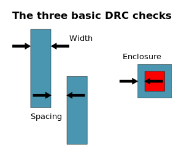
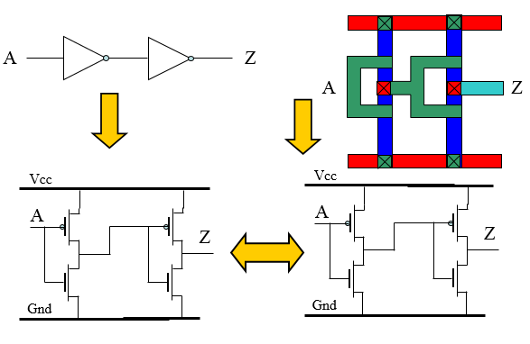
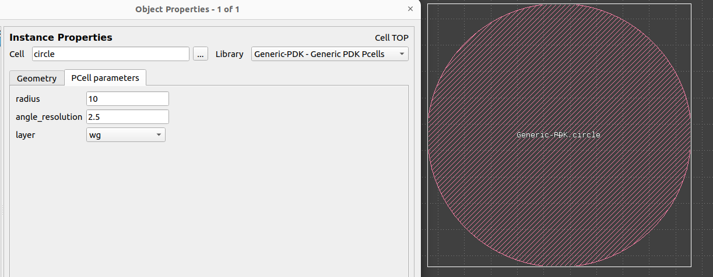

Generic-PDK Klayout
===================

# Table of contents
- [Generic-PDK Klayout](#generic-pdk-klayout)
- [Table of contents](#table-of-contents)
  - [Introduction](#introduction)
  - [Klayout-PDK](#klayout-pdk)
    - [DRC](#drc)
    - [LVS](#lvs)
    - [Pcells](#pcells)
    - [Layers](#layers)

## Introduction

GDSFactory generic PDK refers to a set of predefined building blocks, design rules, and technology files that facilitate the design and fabrication of integrated circuits (ICs) or other microelectronic devices. Unlike a specific PDK tailored for a particular foundry or process node, a generic PDK aims to provide a standardized framework that can be easily adapted or extended for various technology nodes or custom processes.

## Klayout-PDK

KLayout is a powerful open-source layout viewer and editor that also provides extensive capabilities for Design Rule Checking (DRC), Layout Versus Schematic (LVS) verification, and the creation of Parameterized Cells (PCells). 

KLayout offers a user-friendly interface, extensive scripting capabilities (using Ruby or Python), support for various layout formats (such as GDSII, OASIS, and CIF), and integration with external EDA tools and libraries.

### DRC

KLayout offers comprehensive DRC capabilities to ensure that layout designs adhere to specified manufacturing rules and constraints.

  

  Fig. 1. Design Rule Checking (DRC)

The results of DRC checks are displayed visually, allowing users to easily identify and correct violations.

For more information about using Generic-PDK DRC rules, please refer to [Klayout-DRC](./drc/README.md)

### LVS

LVS verification in KLayout involves comparing the layout of a circuit design to its corresponding schematic to ensure consistency and correctness.

  

  Fig. 2. Layout Versus Schematic (LVS)

The LVS verification results highlight any discrepancies between the layout and schematic, facilitating debugging and validation of the design.

For more information about using Generic-PDK LVS rules, please refer to [Klayout-LVS](./lvs/)

### Pcells

PCells enable the creation of customizable and reusable layout components by parameterize certain aspects of the cell's geometry.

  

  Fig. 2. Layout Versus Schematic (LVS)

Users can define parameters such as dimensions, shapes, or properties that can be adjusted to generate variations of the cell.

For more information about using Generic-PDK LVS rules, please refer to [Klayout-Pcells](./pymacros/README.md)

### Layers

Please refer to [GenericPDK-Layers](./tech/generic_layers.csv) file for more details about the available layers supported in GenericPDK technology.
