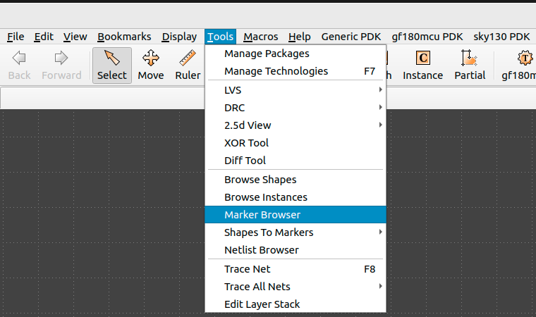
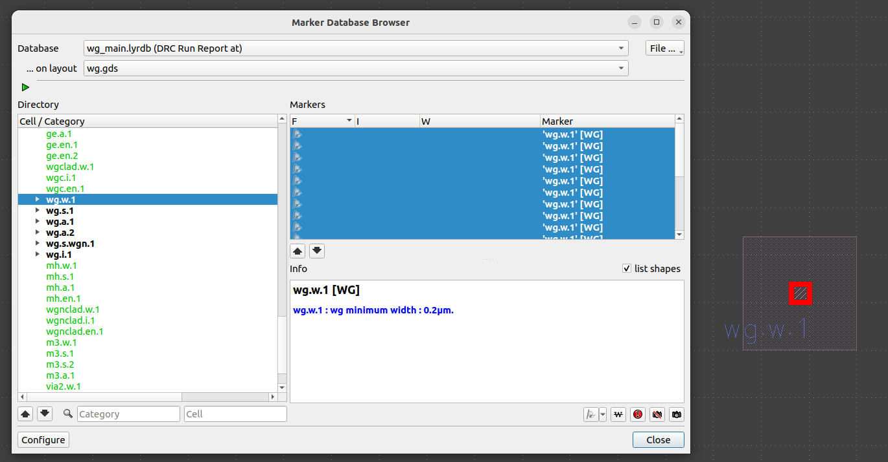

Klayout-DRC
===========

Explains how to use the Generic-PDK DRC.


# Table of contents
- [Klayout-DRC](#klayout-drc)
- [Table of contents](#table-of-contents)
  - [Folder Structure](#folder-structure)
  - [Usage](#usage)
    - [Options](#options)
    - [DRC Outputs](#drc-outputs)
    - [Folder Structure of run results](#folder-structure-of-run-results)


## Folder Structure

```text
📁 drc
 ┣ 📁testing                        Testing environment directory for GenericPDK DRC. 
 ┣ 📁rule_decks                     All DRC rule decks used in GenericPDK.
 ┣ 📜README.md                      This file to document the DRC run for GenericPDK.
 ┗ 📜run_drc.py                     Main python script used for GenericPDK DRC.
 ```

## Usage

The `run_drc.py` script takes a gds file to run DRC rule decks with switches to select subsets of all checks.

```bash
    run_drc.py (--help| -h)
    run_drc.py (--path=<file_path>) [--verbose] [--mp=<num_cores>] [--run_dir=<run_dir_path>] [--topcell=<topcell_name>] [--thr=<thr>] [--run_mode=<run_mode>]
```

Example:

```bash
python3 run_drc.py --path=testing/testcases/unit/wg.gds --run_mode=deep --run_dir=wg_drc_results
```

### Options

`--help -h`                          Print this help message.

`--path=<file_path>`                 The input GDS file path.

`--topcell=<topcell_name>`           Topcell name to use.

`--mp=<num_cores>`                   Run the rule deck in parts in parallel to speed up the run. [default: 1]

`--run_dir=<run_dir_path>`           Run directory to save all the results [default: pwd]

`--thr=<thr>`                        The number of threads used in run.

`--run_mode=<run_mode>`              Select klayout mode Allowed modes (flat , deep, tiling). [default: deep]

`--verbose`                          Detailed rule execution log for debugging.


### DRC Outputs

You could find the run results at your run directory if you previously specified it through `--run_dir=<run_dir_path>`, default path of run directory is `drc_run_<date>_<time>` in current directory.

### Folder Structure of run results

```text
📁 drc_run_<date>_<time>
 ┣ 📜 drc_run_<date>_<time>.log
 ┗ 📜 main.drc
 ┗ 📜 <your_design_name>.lyrdb
 ```

The result is a database file (`<your_design_name>.lyrdb`) contains all violations.
You could view it on your file using: `klayout <input_gds_file> -m <result_db_file> `, or you could view it on your gds file via marker browser option in tools menu using klayout GUI as shown below.

<p align="center">
  
</p>
<p align="center">
  Fig. 1. Klayout GUI marker browser
</p>

After selecting Marker Browser option, you could load the database file and visualize the DRC violations.

<p align="center">
  
</p>
<p align="center">
  Fig. 2. Visualization of DRC violation on Klayout-GUI
</p>
