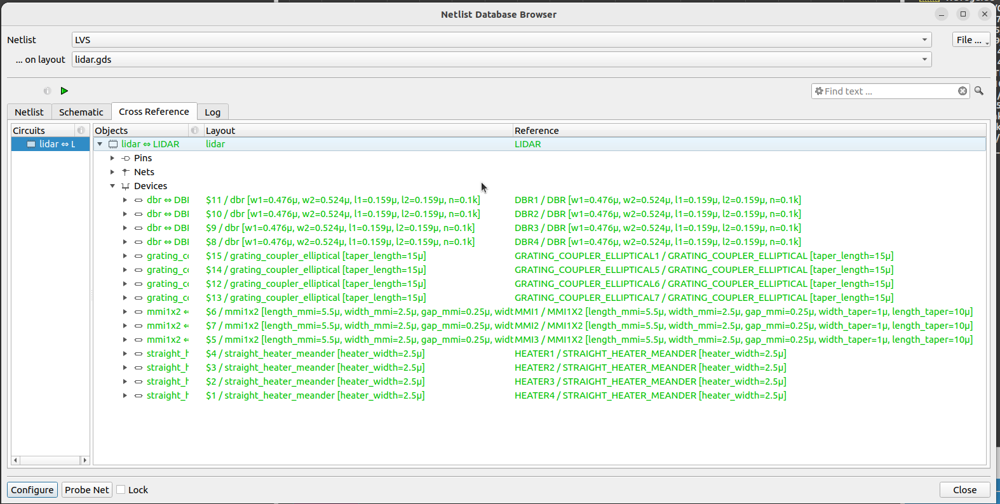
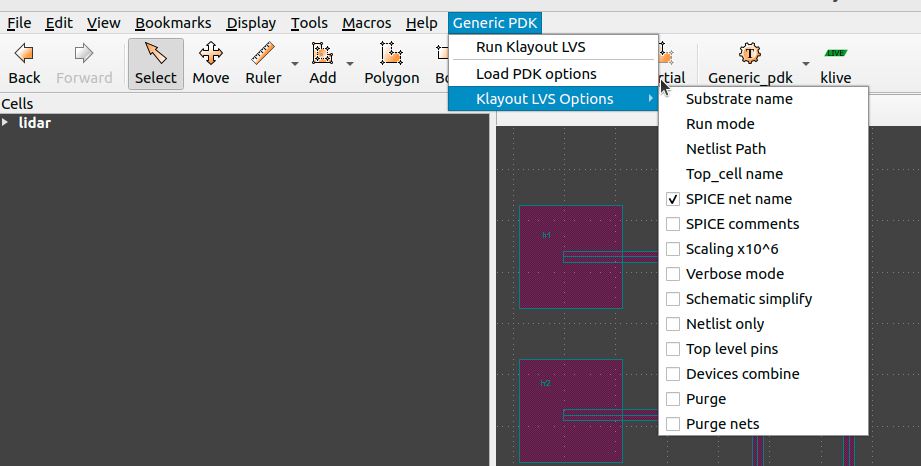
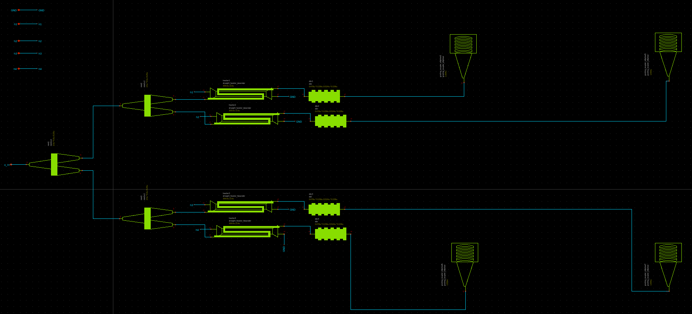
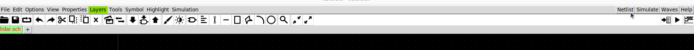
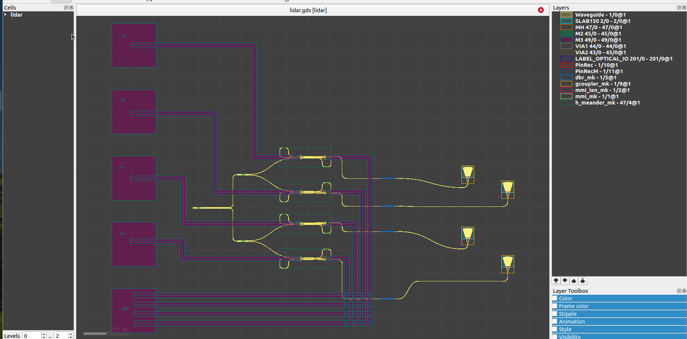

Klayout-LVS
===========

Explains how to use the Generic-PDK LVS.


# Table of contents
- [Klayout-LVS](#klayout-lvs)
- [Table of contents](#table-of-contents)
  - [Folder Structure](#folder-structure)
  - [Devices Status](#devices-status)
  - [Usage](#usage)
    - [CLI](#cli)
      - [Options](#options)
      - [LVS Outputs](#lvs-outputs)
    - [GUI](#gui)
  - [Demo-Example](#demo-example)
    - [Schematic](#schematic)
    - [Layout](#layout)
    - [LVS-Testing](#lvs-testing)
      - [CLI](#cli-1)
      - [GUI](#gui-1)


## Folder Structure

```text
📁 lvs
 ┣ 📁testing                        Testing environment directory for GenericPDK LVS. 
 ┣ 📁rule_decks                     All LVS rule decks used in GenericPDK.
 ┣ generic_tech.lvs                 Main LVS runset that call all rule decks.
 ┣ 📜README.md                      This file to document the LVS run for GenericPDK.
 ┗ 📜run_lvs.py                     Main python script used for GenericPDK LVS.
 ```


## Devices Status

The following table explains the list of available Generic-PDK device we have supported in our LVS runset.

| Device Name                | Measured-Parameters                                        | Tested            |
|----------------------------|------------------------------------------------------------|-------------------|
| mmi1x2                     | `length_mmi, width_mmi, gap_mmi, width_taper, length_taper`|:white_check_mark: |
| straight_heater_meander    | `heater_width`                                             |:white_check_mark: |
| dbr                        | `w1, w2, l1, l2, n`                                        |:white_check_mark: |
| grating_coupler_elliptical | `taper_length`                                             |:white_check_mark: |
| disk                       | `radius, gap`                                              |:white_check_mark: |
| coupler                    | `gap, length, dx, dy`                                      |:white_check_mark: |

> **Note:** All supported devices include marker layers utilized for LVS purposes, which are added automatically through the [GenericPDK Pcells](../pymacros/README.md). If you've implemented these devices using an alternative method, you'll need to manually include these marker layers. Please refer to [GenericPDK-Layers](../README.md#layers) for more info about available layers.

## Usage

You have the option to execute the GenericPDK-LVS through either a Python script via the command-line interface [CLI](#cli) or by the Klayout graphical user interface [GUI](#gui), as detailed in the subsequent usage sections.

### CLI

The `run_lvs.py` script takes your gds and netlist files to run LVS rule decks with switches to select subsets of all checks.

```bash
    run_lvs.py (--help| -h)
    run_lvs.py (--layout=<layout_path>) (--netlist=<netlist_path>) [--thr=<thr>] [--run_dir=<run_dir_path>] [--topcell=<topcell_name>] [--run_mode=<run_mode>] [--verbose] [--lvs_sub=<sub_name>] [--no_net_names] [--spice_comments] [--scale] [--schematic_simplify] [--net_only] [--top_lvl_pins] [--combine] [--purge] [--purge_nets]
```

#### Options

- `--help -h`                           Print this help message.

- `--layout=<layout_path>`              The input GDS file path.

- `--netlist=<netlist_path>`            The input netlist file path.

- `--thr=<thr>`                         The number of threads used in run.

- `--run_dir=<run_dir_path>`            Run directory to save all the results [default: pwd]

- `--topcell=<topcell_name>`            Topcell name to use.

- `--run_mode=<run_mode>`               Select klayout mode Allowed modes (flat , deep, tiling). [default: flat]

- `--lvs_sub=<sub_name>`                Substrate name used in your design.

- `--verbose`                           Detailed rule execution log for debugging.

- `--no_net_names`                      Discard net names in extracted netlist.

- `--spice_comments`                    Enable netlist comments in extracted netlist.

- `--scale`                             Enable scale of 1e6 in extracted netlist.

- `--schematic_simplify`                Enable schematic simplification in input netlist.

- `--net_only`                          Enable netlist object creation only in extracted netlist.

- `--top_lvl_pins`                      Enable top level pins only in extracted netlist.

- `--combine`                           Enable netlist combine only in extracted netlist.

- `--purge`                             Enable netlist purge all only in extracted netlist.

- `--purge_nets`                        Enable netlist purge nets only in extracted netlist.


#### LVS Outputs

You could find the run results at your run directory if you previously specified it through `--run_dir=<run_dir_path>`. Default path of run directory is `lvs_run_<date>_<time>` in current directory.

**Folder Structure of run results**

```text
📁 lvs_run_<date>_<time>
 ┣ 📜 lvs_run_<date>_<time>.log
 ┗ 📜 <your_design_name>.cir
 ┗ 📜 <your_design_name>.lvsdb
 ```

The result is a database file (`<your_design_name>.lvsdb`) contains LVS extractions and comparison results.
You could view it on your file using: `klayout <input_gds_file> -mn <resut_db_file> `, or you could view it on your gds file via netlist browser option in tools menu using klayout GUI as shown below.

<p align="center">
  
</p>
<p align="center">
  Fig. 1. Klayout GUI netlist browser
</p>

After selecting Netlist Browser option, you could load the database file and visualize the LVS results.

<p align="center">
  
</p>
<p align="center">
  Fig. 2. Visualization of LVS results on Klayout-GUI
</p>

You can also locate the extracted netlist generated from your design at `<your_design_name>.cir` within the output directory of the run.

### GUI

The GenericPDK also facilitates LVS execution via Klayout menus, integrated with Klayout through the PDK [installation](../../README.md#installation) as depicted below:

<p align="center">
  
</p>
<p align="center">
  Fig. 3. Visualization of LVS results on Klayout-GUI
</p>

Upon executing the LVS using the `Run Klayout LVS` option, the result database will appear on your layout interface, allowing you to verify the outcome of the run similarly as shown above in Fig. 2.

## Demo-Example

The example shows a Lidar device implemented using GenericPDK technology. 

### Schematic

Figure 4 displays the device's [schematic](./testing/testcases/unit/lidar_device/lidar.sch) created using xschem.

<p align="center">
  
</p>
<p align="center">
  Fig. 4. Schematic for lidar device using GenericPDK
</p>


**Note**: The netlist will be produced in the selected output directory. It is recommended to launch the tool using the following command:

```bash
xschem lidar.sch -o .
```

This command ensures that the output netlist is generated in the current directory.

Following that, you can generate the netlist from this schematic for LVS testing. This can be accomplished by using the 'netlist' option available in the xschem-GUI, as demonstrated in Figure 5.

<p align="center">
  
</p>
<p align="center">
  Fig. 5. Netlist extraction step from xschem for lidar device
</p>

The following netlist the generated from xschem for Lidar device.

```
.subckt lidar o_in GND h1 h2 h3 h4
*.iopin o_in
*.iopin GND
*.iopin h1
*.iopin h2
*.iopin h3
*.iopin h4
Pmmi1 o_in net2 net1 mmi1x2 width=0.5u width_taper=1u length_taper=10u length_mmi=5.5u
+ width_mmi=2.5u gap_mmi=0.25u
Pmmi2 net1 net3 net10 mmi1x2 width=0.5u width_taper=1u length_taper=10u length_mmi=5.5u
+ width_mmi=2.5u gap_mmi=0.25u
Pmmi3 net2 net5 net4 mmi1x2 width=0.5u width_taper=1u length_taper=10u length_mmi=5.5u
+ width_mmi=2.5u gap_mmi=0.25u
Pheater1 net10 net13 h1 GND straight_heater_meander length=300.0u spacing=2.0u heater_width=2.5u
+ extension_length=15.0u radius=90u heater_taper_length=10.0u taper_length=10.0u
Pheater2 net3 net14 h2 GND straight_heater_meander length=300.0u spacing=2.0u heater_width=2.5u
+ extension_length=15.0u radius=90u heater_taper_length=10.0u taper_length=10.0u
Pheater3 net4 net12 h3 GND straight_heater_meander length=300.0u spacing=2.0u heater_width=2.5u
+ extension_length=15.0u radius=90u heater_taper_length=10.0u taper_length=10.0u
Pheater4 net5 net11 h4 GND straight_heater_meander length=300.0u spacing=2.0u heater_width=2.5u
+ extension_length=15.0u radius=90u heater_taper_length=10.0u taper_length=10.0u
Pdbr1 net13 net7 dbr w1=0.476u l1=0.159u w2=0.524u l2=0.159u n=100
Pdbr2 net14 net6 dbr w1=0.476u l1=0.159u w2=0.524u l2=0.159u n=100
Pdbr3 net12 net9 dbr w1=0.476u l1=0.159u w2=0.524u l2=0.159u n=100
Pdbr4 net11 net8 dbr w1=0.476u l1=0.159u w2=0.524u l2=0.159u n=100
Pgrating_coupler_elliptical1 net7 grating_coupler_elliptical taper_length=15u taper_angle=40.0
+ wavelength=1.554u fiber_angle=15.0 grating_line_width=0.343u n_periods=30 slab_xmin=-1.0u slab_offset=2.0u
Pgrating_coupler_elliptical5 net6 grating_coupler_elliptical taper_length=15u taper_angle=40.0
+ wavelength=1.554u fiber_angle=15.0u grating_line_width=0.343u n_periods=30 slab_xmin=-1.0u slab_offset=2.0u
Pgrating_coupler_elliptical6 net8 grating_coupler_elliptical taper_length=15u taper_angle=40.0
+ wavelength=1.554u fiber_angle=15.0u grating_line_width=0.343u n_periods=30 slab_xmin=-1.0u slab_offset=2.0u
Pgrating_coupler_elliptical7 net9 grating_coupler_elliptical taper_length=15u taper_angle=40.0u
+ wavelength=1.554u fiber_angle=15.0 grating_line_width=0.343u n_periods=30 slab_xmin=-1.0u slab_offset=2.0u
.ends
.end
```

### Layout

Figure 6 displays the device's [layout](./testing/testcases/unit/lidar_device/lidar.gds) created using Klayout.

<p align="center">
  
</p>
<p align="center">
  Fig. 5. Layout for Lidar device implemented using GenericPDK
</p>

### LVS-Testing

#### CLI

```bash
    python3 run_lvs.py --layout=testing/testcases/unit/lidar_device/lidar.gds --netlist=testing/testcases/unit/lidar_device/lidar.cdl --run_dir=lvs_lidar_run
```

Please refer to [Usage](#usage) section for more details.

#### GUI

You could also run the LVS using Klayout-Menus supported for GenericPDK as explained above in Fig. 3.
