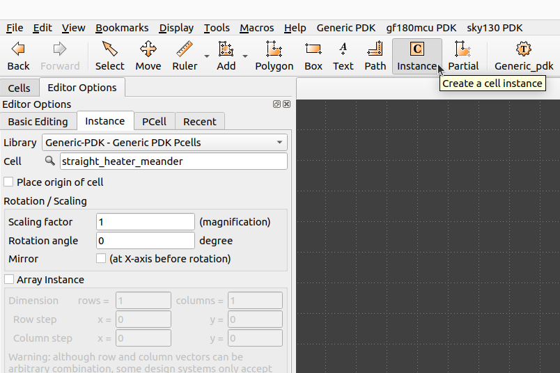
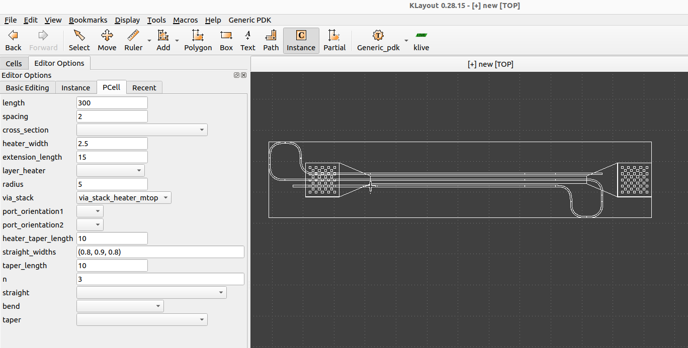
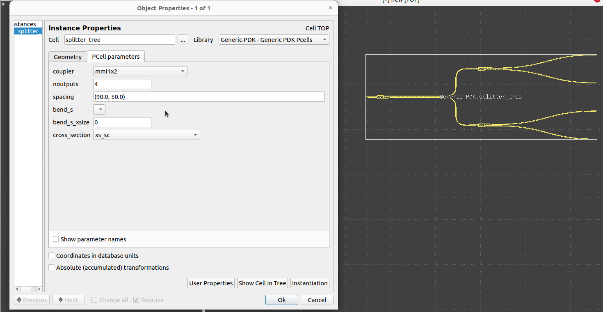

Klayout-Pcells
==============

Explains how to use the Generic-PDK Pcells.

# Table of contents
- [Klayout-Pcells](#klayout-pcells)
- [Table of contents](#table-of-contents)
  - [Folder Structure](#folder-structure)
  - [Devices Status](#devices-status)
  - [Usage](#usage)

## Folder Structure

```text
📁 drc
 ┣ 📁generic_pcells                 Scripts used for GenericPDK Pcells. 
 ┣ 📜__init__.py                    python init file.
 ┗ 📜generic_pdk.lym                Main script used for Loading GenericPDK Pcells.
 ┣ 📜README.md                      This file to document the Pcells for GenericPDK.
 ```

## Devices Status

The current Pcells supports all valid Generic-PDK cells for gdsfactory 7.12.0, the full list of available pcells could be found [here]((https://gdsfactory.github.io/gdsfactory/components.html#generic-pdk)).


## Usage

Once you have installed the GenericPDK using the [installation script](../../README.md#installation), you could use the pcells directly from Klayout as shown:

<p align="center">
  
</p>
<p align="center">
  Fig. 1. GenericPDK Pcells instantiation
</p>

After selecting the pcell you need, you could place it directly with its default parameters, or you could adjust these values as you needed from Pcell tab as shown:

<p align="center">
  
</p>
<p align="center">
  Fig. 1. GenericPDK Pcells instantiation
</p>

You could also update the pcell parameters after placing it in you layout as shown:

> **Note:** Press Q on the cell to open its properties.

<p align="center">
  
</p>
<p align="center">
  Fig. 1. GenericPDK Pcells instantiation
</p>


> :warning: **Be careful** when changing parameters values as this is related to understanding the pcell-device and its parameters, refer to for more information about [GenericPDK-Pcells](https://gdsfactory.github.io/gdsfactory/components.html#generic-pdk)

