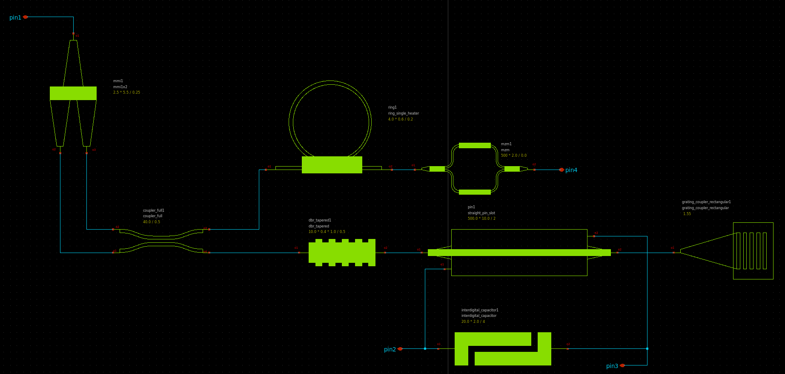

Generic-PDK-Symbols
===================

# Table of contents
- [Generic-PDK-Symbols](#generic-pdk-symbols)
- [Table of contents](#table-of-contents)
  - [Introduction](#introduction)
  - [Devices Status](#devices-status)
  - [Usage](#usage)


## Introduction

Generic PDK symbols are implemented using xschem open source tool, it's a simple editor provide a user-friendly interface for drawing, connecting, and annotating symbols that represent various photonic elements such as waveguides, couplers, rings, and more.

## Devices Status

The following table explains the list of available Generic-PDK symbols we have supported.


| Device Name                                | Tested             |
|--------------------------------------------|--------------------|
| cdc                                        | :white_check_mark: |                    
| coupler_adiabatic                          | :white_check_mark: |               
| coupler_bent                               | :white_check_mark: |          
| coupler_broadband                          | :white_check_mark: |               
| coupler_full                               | :white_check_mark: |          
| coupler_ring                               | :white_check_mark: |          
| coupler                                    | :white_check_mark: |     
| dbr                                        | :white_check_mark: | 
| dbr_tapered                                | :white_check_mark: |         
| disk_heater                                | :white_check_mark: |         
| disk                                       | :white_check_mark: |  
| ge_detector_straight_si_contacts           | :white_check_mark: |                              
| grating_coupler_elliptical_arbitrary       | :white_check_mark: |                                  
| grating_coupler_elliptical_lumerical       | :white_check_mark: |                                  
| grating_coupler_elliptical                 | :white_check_mark: |                        
| grating_coupler_elliptical_trenches        | :white_check_mark: |                                 
| grating_coupler_elliptical_uniform         | :white_check_mark: |                                
| grating_coupler_rectangular_arbitrary_slab | :white_check_mark: |                                          
| grating_coupler_rectangular_arbitrary      | :white_check_mark: |                                   
| grating_coupler_rectangular                | :white_check_mark: |                         
| interdigital_capacitor                     | :white_check_mark: |                    
| mmi1x2                                     | :white_check_mark: |    
| mmi1x2_with_sbend                          | :white_check_mark: |               
| mmi2x2                                     | :white_check_mark: |    
| mmi2x2_with_sbend                          | :white_check_mark: |               
| mmi_90degree_hybrid                        | :white_check_mark: |                 
| mode_converter                             | :white_check_mark: |            
| mzi1x2_2x2                                 | :white_check_mark: |        
| mzi2x2_2x2_phase_shifter                   | :white_check_mark: |                      
| mzi_phase_shifter                          | :white_check_mark: |               
| mzi                                        | :white_check_mark: | 
| mzit                                       | :white_check_mark: |  
| mzm                                        | :white_check_mark: | 
| polarization_splitter_rotator              | :white_check_mark: |                           
| resistance_sheet                           | :white_check_mark: |              
| ring_double_heater                         | :white_check_mark: |                
| ring_double_pn                             | :white_check_mark: |            
| ring_double                                | :white_check_mark: |         
| ring_single_bend_coupler                   | :white_check_mark: |                      
| ring_single_heater                         | :white_check_mark: |                
| ring_single_pn                             | :white_check_mark: |            
| ring_single                                | :white_check_mark: |         
| straight_heater_doped_rib                  | :white_check_mark: |                       
| straight_heater_doped_strip                | :white_check_mark: |                         
| straight_heater_meander_doped              | :white_check_mark: |                           
| straight_heater_meander                    | :white_check_mark: |                     
| straight_heater_metal_90_90                | :white_check_mark: |                         
| straight_heater_metal_simple               | :white_check_mark: |                          
| straight_heater_metal                      | :white_check_mark: |                   
| straight_heater_metal_undercut_90_90       | :white_check_mark: |                                  
| straight_heater_metal_undercut             | :white_check_mark: |                            
| straight_pin_slot                          | :white_check_mark: |               
| straight_pin                               | :white_check_mark: |          
| straight_pn                                | :white_check_mark: |         

## Usage

You could check some available [tests](./tests/) for current added symbols, just open xschem in the current directory:

```bash
xschem -o .
```

<p align="center">
  
</p>
<p align="center">
  Fig. 1. Available xschem tests for added symbols.
</p>

Simple Generic-PDK schematic is depicted in Fig. 2.

<p align="center">
  
</p>
<p align="center">
  Fig. 2. Example for Generic-PDK schematic.
</p>

The following netlist is generated from xschem for the previous example:

```
.subckt test_general2 pin1 pin2 pin3 pin4
*.PININFO pin1:B pin2:B pin3:B pin4:B
Pcoupler_full1 net1 net2 net4 net3 coupler_full coupling_length=40.0u dx=10.0u dy=4.8u gap=0.5u dw=0.1u
Pdbr_tapered1 net3 net5 dbr_tapered length=10.0u period=0.85 duty_cycle=0.5 w1=0.4u w2=1.0u
+ taper_length=20.0u
Pinterdigital_capacitor1 pin2 pin3 interdigital_capacitor fingers=4 finger_length=20.0u
+ finger_gap=2.0u thickness=5.0u
Pmmi1 pin1 net2 net1 mmi1x2 width=0.5u width_taper=1u length_taper=10u length_mmi=5.5u width_mmi=2.5u
+ gap_mmi=0.25u
Pring1 net4 net4 net7 ring_single_heater gap=0.2u radius=10.0u length_x=4.0u length_y=0.6u
Ppin1 net5 net6 pin3 pin2 straight_pin_slot length=500.0u via_stack_width=10.0u
+ via_stack_slab_width=10.0u via_stack_spacing=2u via_stack_slab_spacing=2.0u
Pgrating_coupler_rectangular1 net6 grating_coupler_rectangular n_periods=20 period=0.75
+ fill_factor=0.5 width_grating=11.0u length_taper=150.0u wavelength=1.55u fiber_angle=15 slab_xmin=-1.0u slab_offset=1.0u
Pmzm1 net7 pin4 mzm length_x=500u length_y=2.0u delta_length=0.0u
.ends
```
