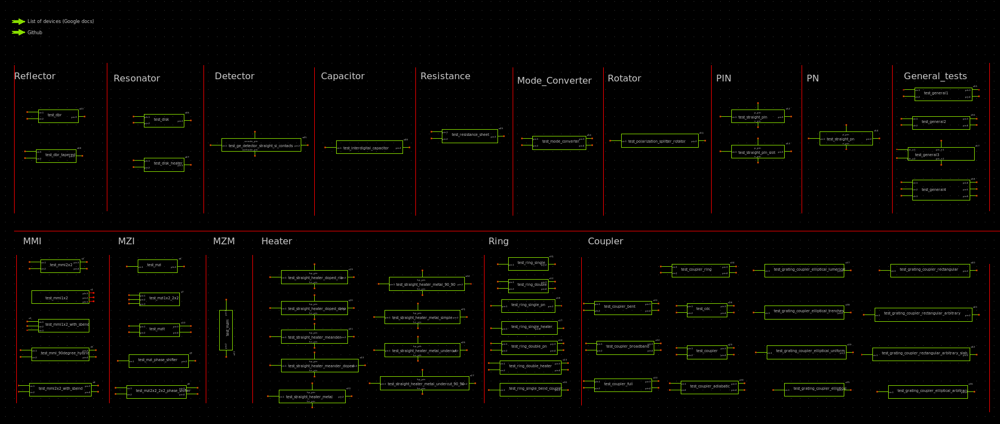

Generic-PDK-Symbols
===================

# Table of contents
- [Generic-PDK-Symbols](#generic-pdk-symbols)
- [Table of contents](#table-of-contents)
  - [Introduction](#introduction)
  - [Devices Status](#devices-status)
  - [Usage](#usage)


## Introduction

Generic PDK symbols are implemented using xschem open source tool, it's a simple editor provide a user-friendly interface for drawing, connecting, and annotating symbols that represent various photonic elements such as waveguides, couplers, rings, and more.

## Devices Status

The following table explains the list of available Generic-PDK symbols we have supported.


| Device Name                                | Tested             |
|--------------------------------------------|--------------------|
| cdc                                        | :white_check_mark: |                    
| coupler_adiabatic                          | :white_check_mark: |               
| coupler_bent                               | :white_check_mark: |          
| coupler_broadband                          | :white_check_mark: |               
| coupler_full                               | :white_check_mark: |          
| coupler_ring                               | :white_check_mark: |          
| coupler                                    | :white_check_mark: |     
| dbr                                        | :white_check_mark: | 
| dbr_tapered                                | :white_check_mark: |         
| disk_heater                                | :white_check_mark: |         
| disk                                       | :white_check_mark: |  
| ge_detector_straight_si_contacts           | :white_check_mark: |                              
| grating_coupler_elliptical_arbitrary       | :white_check_mark: |                                  
| grating_coupler_elliptical_lumerical       | :white_check_mark: |                                  
| grating_coupler_elliptical                 | :white_check_mark: |                        
| grating_coupler_elliptical_trenches        | :white_check_mark: |                                 
| grating_coupler_elliptical_uniform         | :white_check_mark: |                                
| grating_coupler_rectangular_arbitrary_slab | :white_check_mark: |                                          
| grating_coupler_rectangular_arbitrary      | :white_check_mark: |                                   
| grating_coupler_rectangular                | :white_check_mark: |                         
| interdigital_capacitor                     | :white_check_mark: |                    
| mmi1x2                                     | :white_check_mark: |    
| mmi1x2_with_sbend                          | :white_check_mark: |               
| mmi2x2                                     | :white_check_mark: |    
| mmi2x2_with_sbend                          | :white_check_mark: |               
| mmi_90degree_hybrid                        | :white_check_mark: |                 
| mode_converter                             | :white_check_mark: |            
| mzi1x2_2x2                                 | :white_check_mark: |        
| mzi2x2_2x2_phase_shifter                   | :white_check_mark: |                      
| mzi_phase_shifter                          | :white_check_mark: |               
| mzi                                        | :white_check_mark: | 
| mzit                                       | :white_check_mark: |  
| mzm                                        | :white_check_mark: | 
| polarization_splitter_rotator              | :white_check_mark: |                           
| resistance_sheet                           | :white_check_mark: |              
| ring_double_heater                         | :white_check_mark: |                
| ring_double_pn                             | :white_check_mark: |            
| ring_double                                | :white_check_mark: |         
| ring_single_bend_coupler                   | :white_check_mark: |                      
| ring_single_heater                         | :white_check_mark: |                
| ring_single_pn                             | :white_check_mark: |            
| ring_single                                | :white_check_mark: |         
| straight_heater_doped_rib                  | :white_check_mark: |                       
| straight_heater_doped_strip                | :white_check_mark: |                         
| straight_heater_meander_doped              | :white_check_mark: |                           
| straight_heater_meander                    | :white_check_mark: |                     
| straight_heater_metal_90_90                | :white_check_mark: |                         
| straight_heater_metal_simple               | :white_check_mark: |                          
| straight_heater_metal                      | :white_check_mark: |                   
| straight_heater_metal_undercut_90_90       | :white_check_mark: |                                  
| straight_heater_metal_undercut             | :white_check_mark: |                            
| straight_pin_slot                          | :white_check_mark: |               
| straight_pin                               | :white_check_mark: |          
| straight_pn                                | :white_check_mark: |         

## Usage

You could check some available [tests](./tests/) for current added symbols, just open xschem in the current directory:

```bash
xschem -o .
```

<p align="center">
  
</p>
<p align="center">
  Fig. 1. Available xschem tests for added symbols.
</p>

Simple Generic-PDK schematic for Lidar device is depicted in Fig. 2.

<p align="center">
  
</p>
<p align="center">
  Fig. 2. Example for Generic-PDK schematic.
</p>

The following netlist is generated from xschem for the previous example:

```
.subckt lidar o_in GND h1 h2 h3 h4
*.iopin o_in
*.iopin GND
*.iopin h1
*.iopin h2
*.iopin h3
*.iopin h4
Pmmi1 o_in net2 net1 mmi1x2 width=0.5u width_taper=1u length_taper=10u length_mmi=5.5u
+ width_mmi=2.5u gap_mmi=0.25u
Pmmi2 net1 net3 net10 mmi1x2 width=0.5u width_taper=1u length_taper=10u length_mmi=5.5u
+ width_mmi=2.5u gap_mmi=0.25u
Pmmi3 net2 net5 net4 mmi1x2 width=0.5u width_taper=1u length_taper=10u length_mmi=5.5u
+ width_mmi=2.5u gap_mmi=0.25u
Pheater1 net10 net13 h1 GND straight_heater_meander length=300.0u spacing=2.0u heater_width=2.5u
+ extension_length=15.0u radius=90u heater_taper_length=10.0u taper_length=10.0u
Pheater2 net3 net14 h2 GND straight_heater_meander length=300.0u spacing=2.0u heater_width=2.5u
+ extension_length=15.0u radius=90u heater_taper_length=10.0u taper_length=10.0u
Pheater3 net4 net12 h3 GND straight_heater_meander length=300.0u spacing=2.0u heater_width=2.5u
+ extension_length=15.0u radius=90u heater_taper_length=10.0u taper_length=10.0u
Pheater4 net5 net11 h4 GND straight_heater_meander length=300.0u spacing=2.0u heater_width=2.5u
+ extension_length=15.0u radius=90u heater_taper_length=10.0u taper_length=10.0u
Pdbr1 net13 net7 dbr w1=0.476u l1=0.159u w2=0.524u l2=0.159u n=100
Pdbr2 net14 net6 dbr w1=0.476u l1=0.159u w2=0.524u l2=0.159u n=100
Pdbr3 net12 net9 dbr w1=0.476u l1=0.159u w2=0.524u l2=0.159u n=100
Pdbr4 net11 net8 dbr w1=0.476u l1=0.159u w2=0.524u l2=0.159u n=100
Pgrating_coupler_elliptical1 net7 grating_coupler_elliptical taper_length=15u taper_angle=40.0
+ wavelength=1.554u fiber_angle=15.0 grating_line_width=0.343u n_periods=30 slab_xmin=-1.0u slab_offset=2.0u
Pgrating_coupler_elliptical5 net6 grating_coupler_elliptical taper_length=15u taper_angle=40.0
+ wavelength=1.554u fiber_angle=15.0u grating_line_width=0.343u n_periods=30 slab_xmin=-1.0u slab_offset=2.0u
Pgrating_coupler_elliptical6 net8 grating_coupler_elliptical taper_length=15u taper_angle=40.0
+ wavelength=1.554u fiber_angle=15.0u grating_line_width=0.343u n_periods=30 slab_xmin=-1.0u slab_offset=2.0u
Pgrating_coupler_elliptical7 net9 grating_coupler_elliptical taper_length=15u taper_angle=40.0u
+ wavelength=1.554u fiber_angle=15.0 grating_line_width=0.343u n_periods=30 slab_xmin=-1.0u slab_offset=2.0u
.ends
.end
```
